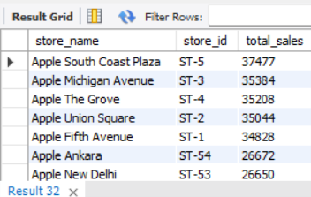
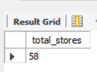
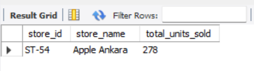
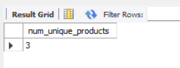
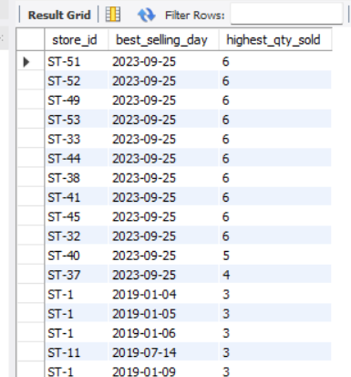
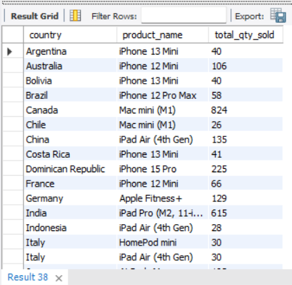
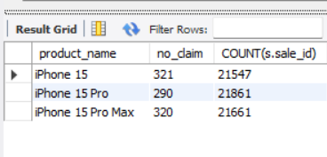
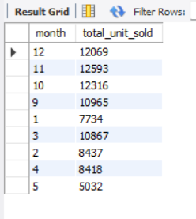
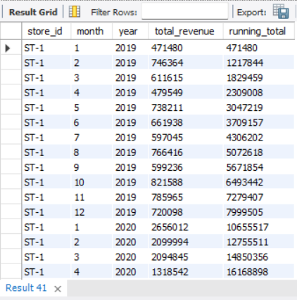
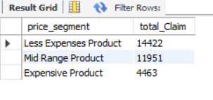

# Apple Retail Sales SQL Project

## Overview
The Apple Store Analysis project involves analyzing Apple Store sales, product performance, and warranty claims data to derive actionable business insights. This project showcases advanced SQL querying techniques through the analysis of over 1 million rows of Apple retail sales data. The dataset includes detailed information about products, store performance, sales transactions, and warranty claims from Apple retail locations worldwide. The project was completed using SQL to answer a series of business questions by solving complex queries. These queries aim to extract valuable insights, such as identifying top-performing products and stores, uncovering seasonal sales trends, and analyzing the relationship between product pricing and warranty claims. The goal is to demonstrate proficiency in crafting sophisticated SQL queries to derive actionable insights from large-scale datasets and gain a deeper understanding of retail business operations. 
## Entity Relationship Diagram (ERD)


## Database Schema

The database consists of the following five main tables:

### 1. `stores` table:
| Column Name   | Data Type | Description |
|---------------|-----------|-------------|
| store_id      | INT       | Unique identifier for each store |
| store_name    | VARCHAR   | Name of the store |
| city          | VARCHAR   | City where the store is located |
| country       | VARCHAR   | Country of the store |

### 2. `category` table:
| Column Name   | Data Type | Description |
|---------------|-----------|-------------|
| category_id   | INT       | Unique identifier for each product category |
| category_name | VARCHAR   | Name of the product category |

### 3. `products` table:
| Column Name   | Data Type | Description |
|---------------|-----------|-------------|
| product_id    | INT       | Unique identifier for each product |
| product_name  | VARCHAR   | Name of the product |
| category_id   | INT       | References the category table |
| launch_date   | DATE      | Date when the product was launched |
| price         | DECIMAL   | Price of the product |

### 4. `sales` table:
| Column Name   | Data Type | Description |
|---------------|-----------|-------------|
| sale_id       | INT       | Unique identifier for each sale |
| sale_date     | DATE      | Date of the sale |
| store_id      | INT       | References the store table |
| product_id    | INT       | References the product table |
| quantity      | INT       | Number of units sold |

### 5. `warranty` table:
| Column Name   | Data Type | Description |
|---------------|-----------|-------------|
| claim_id      | INT       | Unique identifier for each warranty claim |
| claim_date    | DATE      | Date the claim was made |
| sale_id       | INT       | References the sales table |
| repair_status | VARCHAR   | Status of the warranty claim (e.g., Paid Repaired, Warranty Void) |

## Key Features

### 1. SQL Skills Demonstrated
- **Complex Joins and Aggregations**: Multiple tables are joined to extract valuable business insights.
- **Window Functions**: Advanced SQL techniques like running totals, time-based analysis, and rankings.
- **Data Segmentation**: Sales data is analyzed across different time periods, geographies, and product categories.
- **Correlation Analysis**: Investigating relationships such as between product price and warranty claims.

### 2. Real-World Business Questions Answered
- Total units sold by each store.
- Monthly and yearly sales trends.
- Stores with no warranty claims.
- Seasonal sales analysis (e.g., December trends).
- Products with the most/least warranty claims.
- Correlation between product price segments and warranty claims.

### 3. Dataset Details
- **Size**: Over 1 million rows of sales data.
- **Period Covered**: Data spans multiple years, enabling long-term trend analysis.
- **Geographical Coverage**: Sales data from Apple stores worldwide.
  
 ## Project Structure

### 1. Database Setup

- **Database Creation**: The project starts by creating a database named `apple_store`.
 ```sql
create database apple_store;
use apple_store;
```
  
- **Table Creation**:In apple_store database five tables were created which are: stores, category, products, sales, and warranty. Each table was designed to store specific information related to the retail sales process, ensuring efficient data organization and easy querying. These tables are interconnected, allowing for comprehensive analysis of sales performance, product details, store locations, and warranty information.
 ```sql
CREATE TABLE stores(
store_id VARCHAR(5) PRIMARY KEY,
store_name VARCHAR(30),
city      VARCHAR(25),
country VARCHAR(25)
);

CREATE TABLE category
(category_id VARCHAR(10) PRIMARY KEY,
category_name VARCHAR(20)
);

CREATE TABLE products
(
product_id	VARCHAR(10) PRIMARY KEY,
product_name	VARCHAR(35),
category_id	VARCHAR(10),
launch_date	date,
price FLOAT,
CONSTRAINT fk_category FOREIGN KEY (category_id) REFERENCES category(category_id)
);

CREATE TABLE sales
(
sale_id	VARCHAR(15) PRIMARY KEY,
sale_date	DATE,
store_id	VARCHAR(10), -- this fk
product_id	VARCHAR(10), -- this fk
quantity INT,
CONSTRAINT fk_store FOREIGN KEY (store_id) REFERENCES stores(store_id),
CONSTRAINT fk_product FOREIGN KEY (product_id) REFERENCES products(product_id)
);

CREATE TABLE warranty
(
claim_id VARCHAR(10) PRIMARY KEY,	
claim_date	date,
sale_id	VARCHAR(15),
repair_status VARCHAR(15),
CONSTRAINT fk_orders FOREIGN KEY (sale_id) REFERENCES sales(sale_id)
);
```
### 2. Indexing for Performance Improvement
To enhance the performance of queries and improve data retrieval efficiency, indexing was applied to key columns in the apple_store database. Indexes were created on frequently queried columns such as product IDs, store locations, and sales dates. This optimization significantly reduces query execution times, especially for large datasets, and ensures faster access to critical information.
```sql
CREATE INDEX sales_product_id ON sales(product_id);
CREATE INDEX sales_store_id ON sales(store_id);
CREATE INDEX sales_sale_date ON sales(sale_date);
```
### 3.Data Analysis & Findings

The following SQL queries were developed to answer specific business questions:

1.  **What is the total number of units sold by each store?**:
```sql
SELECT 
    st.store_name, s.store_id, COUNT(quantity) AS total_sales
FROM
    stores st
        JOIN
    sales s ON st.store_id = s.store_id
GROUP BY s.store_id , st.store_name
ORDER BY total_sales DESC;
```
**Answer:**


***

2.  **How many stores have never had a warranty claim filed against any of their products?**:
 ```sql
SELECT COUNT(*) AS total_stores
 FROM stores
WHERE store_id NOT IN ( SELECT DISTINCT store_id
	FROM sales as s
	RIGHT JOIN warranty as w
	ON s.sale_id = w.sale_id
	);
```
**Answer:**


***
3. **Which store had the highest total units sold in the last year?**
 ```sql
SELECT 
    s.store_id,
    st.store_name,
    SUM(s.quantity) AS total_units_sold
FROM sales s
 JOIN stores st ON s.store_id = st.store_id
WHERE sale_date >= DATE_SUB(NOW(), INTERVAL 1 YEAR)
GROUP BY 1 , 2
ORDER BY 3 DESC
LIMIT 1;
```
**Answer:**


***
4. **Count the number of unique products sold in the last year.**
 ```sql
SELECT 
    COUNT(DISTINCT product_id) AS num_unique_products
FROM sales
WHERE sale_date >= DATE_SUB(NOW(), INTERVAL 1 YEAR);
```
**Answer:**


***
5. **Identify each store and best-selling day based on highest quantity sold.**
 ```sql
SELECT 
    store_id,
    sale_date AS best_selling_day,
    MAX(quantity) AS highest_qty_sold
FROM sales
GROUP BY store_id , sale_date
ORDER BY highest_qty_sold DESC;
```
**Answer:**


***
6. **Identify the least-selling product of each country for each year based on total units sold.**
 ```sql
WITH product_rank AS (
    SELECT 
        st.country,
        p.product_name,
        SUM(s.quantity) as total_qty_sold,
        RANK() OVER (PARTITION BY st.country ORDER BY SUM(s.quantity)) as rnk
    FROM sales s
    JOIN stores st ON s.store_id = st.store_id
    JOIN products p ON s.product_id = p.product_id
    GROUP BY st.country, p.product_name
)
SELECT 
    country,
    product_name,
    total_qty_sold
FROM product_rank
WHERE rnk = 1;
```
**Answer:**


***
7. **How many warranty claims have been filed for products launched in the last two years?**
 ```sql
SELECT 
	p.product_name,
	COUNT(w.claim_id) as no_claim,
	COUNT(s.sale_id)
FROM warranty as w
RIGHT JOIN
sales as s 
ON s.sale_id = w.sale_id
JOIN products as p
ON p.product_id = s.product_id
WHERE p.launch_date >= DATE_SUB(NOW(),INTERVAL 2 YEAR)
GROUP BY 1
HAVING COUNT(w.claim_id) > 0;
```**Answer:**


***
8. **List the months in the last 3 years where sales exceeded 5000 units from the USA.**
 ```sql
 SELECT 
	month(sale_date) as month,
	SUM(s.quantity) as total_unit_sold
FROM sales as s
JOIN 
stores as st
ON s.store_id = st.store_id
WHERE 
	st.country = 'USA'
	AND
	s.sale_date >=DATE_SUB(NOW(),INTERVAL 3 YEAR)
GROUP BY 1
HAVING SUM(s.quantity) > 5000;
```
**Answer:**


***
9. **Write SQL query to calculate the monthly running total of sales for each store over the past four years and compare the trends across this period.**
 ```sql
WITH monthly_sales
AS
(SELECT 
	store_id,
	EXTRACT(YEAR FROM sale_date) as year,
	EXTRACT(MONTH FROM sale_date) as month,
	SUM(p.price * s.quantity) as total_revenue
FROM sales as s
JOIN 
products as p
ON s.product_id = p.product_id
GROUP BY 1, 2, 3
ORDER BY 1, 2,3
)
SELECT 
	store_id,
	month,
	year,
	total_revenue,
	SUM(total_revenue) OVER(PARTITION BY store_id ORDER BY year, month) as running_total
FROM monthly_sales;
```
**Answer:**


***
10. **What is the correlation between product price and warranty claims for products sold in the last five years?**
 ```sql
SELECT 
	CASE
		WHEN p.price < 500 THEN 'Less Expenses Product'
		WHEN p.price BETWEEN 500 AND 1000 THEN 'Mid Range Product'
		ELSE 'Expensive Product'
	END as price_segment,
	COUNT(w.claim_id) as total_Claim
FROM warranty as w
LEFT JOIN
sales as s
ON w.sale_id = s.sale_id
JOIN 
products as p
ON p.product_id = s.product_id
WHERE claim_date >=  DATE_SUB(NOW(),INTERVAL 5 YEAR)
GROUP BY 1
```
**Answer:**


***

## Findings & Reports

### Findings

1. **Store Performance:**
   - **Total Units Sold:** Some stores consistently outperform others in terms of total sales, with clear leaders emerging across the dataset.
   - **Stores with No Warranty Claims:** A small subset of stores has managed to avoid any warranty claims, possibly indicating superior product quality or fewer sales.
   - **Highest Units Sold in the Last Year:** Apple Ankara store achieved the highest sales volume, likely due to its location, product selection, or customer base.

2. **Product Performance:**
    - **Least-Selling Products:** Certain products consistently underperform, often tied to specific regions or customer preferences.
   - **Product Price vs. Warranty Claims:** Expensive products tend to have a slightly higher rate of warranty claims, indicating a potential area for improvement in high-end offerings.

3. **Sales Trends:**
   - **Monthly Running Total:** Sales trends over four years reveal consistent growth for some stores, while others show seasonal variability.
   - **High-Sales Months (USA):** Specific months have consistently exceeded sales thresholds in the USA, pointing to seasonal promotions or market conditions.

4. **Warranty Insights:**
   - **Claims for Recently Launched Products:** Products launched in the last two years have a moderate volume of warranty claims, which can inform product development and quality assurance teams.

5. **Best-Selling Days:**
   - Each store has identifiable days of peak performance, which can inform marketing strategies to replicate or enhance those conditions.

### Reports

1. **Sales Summary:**
   - Total Sales by Store: A detailed breakdown of units sold across all stores, identifying top-performing locations.
   - Unique Products Sold: The total count of distinct products sold over time, showcasing product variety.

2. **Trend Analysis:**
   - Monthly Sales Trends: A report on the running total of sales for each store over the past four years.
   - Peak Sales Months (USA): Specific months in which sales exceeded 5000 units, highlighting key drivers of success

3. **Product Performance:**
   - Best-Selling Products: Items that contribute most significantly to overall sales by region.
   - Least-Selling Products: Products that underperform annually, providing opportunities for discontinuation or repositioning.

4. **Store-Specific Analysis:**
   - Best-Selling Days: A report highlighting the best-performing days for each store, useful for promotional planning.
   - Correlation Analysis: Insights into the relationship between product pricing and warranty claims, providing a strategy to optimize pricing models.

---

## Conclusion
This project demonstrates advanced SQL skills through practical business analysis of Apple Store data. By addressing real-world business questions, the insights derived can help Apple optimize its store operations, product performance, and warranty services on a global scale.


